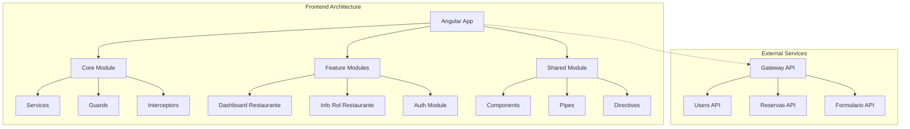
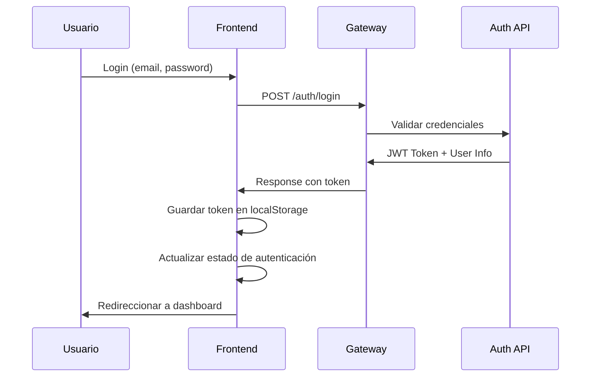

# 🍽️ FoodiesBNB Frontend

<div align="center">
  
  
  
  
</div>

<div align="center">
  <h3>🚀 Plataforma de Reservas para Microinfluencers y Restaurantes</h3>
  <p><strong>Frontend Angular 17+ con Arquitectura Modular y SSR</strong></p>
</div>

---

## 👨‍💻 **Autor**

**Jhoel Suárez**  
*Ingeniero de Software*  
📧 [Contacto](mailto:jhoel@foodiesbnb.com) | 💼 [LinkedIn](https://linkedin.com/in/jhoel-suarez)

---

## 📖 **Descripción del Proyecto**

FoodiesBNB Frontend es una aplicación web moderna desarrollada en **Angular 17+** que conecta microinfluencers gastronómicos con restaurantes, facilitando reservas, gestión de contenido y análisis de rendimiento. La plataforma implementa un sistema de roles avanzado con dashboards especializados.

### 🎯 **Características Principales**

- 🔐 **Autenticación JWT** con sistema de roles
- 📱 **Responsive Design** con PrimeNG y Font Awesome
- 🏪 **Dashboard Restaurante** para gestión de reservas
- 👤 **Perfil de Usuario** con configuración personalizada
- 📊 **Analytics** en tiempo real
- 🚀 **Server-Side Rendering (SSR)** para SEO optimizado
- 🎨 **Tema FoodiesBNB** con colores corporativos

---

## 🏗️ **Arquitectura del Sistema**



### 📂 **Estructura de Directorios**

```
src/
├── 📁 app/
│   ├── 📁 core/                    # Servicios principales y configuración
│   │   ├── 📁 guards/              # Route guards para autenticación
│   │   ├── 📁 interceptors/        # HTTP interceptors
│   │   ├── 📁 models/              # Interfaces TypeScript
│   │   └── 📁 services/            # Servicios de negocio
│   │       ├── auth.service.ts     # Autenticación JWT
│   │       └── reserva.service.ts  # Gestión de reservas
│   ├── 📁 modules/                 # Módulos de funcionalidad
│   │   ├── 📁 dashboard-restaurante/   # Dashboard para restaurantes
│   │   │   ├── dashboard-restaurante.component.ts
│   │   │   ├── dashboard-restaurante.component.html
│   │   │   ├── dashboard-restaurante.component.css
│   │   │   ├── role.service.ts         # Gestión de roles
│   │   │   └── filter.pipe.ts          # Pipe para filtrado
│   │   └── 📁 inforolrestaurante/      # Información para restaurantes
│   ├── 📁 shared/                  # Componentes compartidos
│   │   ├── 📁 components/          # Componentes reutilizables
│   │   ├── 📁 pipes/              # Pipes personalizados
│   │   └── 📁 directives/         # Directivas personalizadas
│   └── 📁 environments/           # Configuración de entornos
├── 📁 public/                     # Recursos estáticos
│   ├── 📁 assets/                 # Imágenes y recursos
│   └── 📁 img/                    # Imágenes de la aplicación
└── 📄 package.json               # Dependencias del proyecto
```

---

## 🔧 **Tecnologías y Dependencias**

### **Framework Principal**
- **Angular 17+** - Framework principal con Standalone Components
- **TypeScript 5+** - Lenguaje de programación tipado
- **RxJS** - Programación reactiva

### **UI/UX**
- **PrimeNG** - Biblioteca de componentes UI
- **Font Awesome** - Iconografía
- **CSS Custom Properties** - Variables CSS personalizadas

### **Herramientas de Desarrollo**
- **Angular CLI** - Herramientas de desarrollo
- **ESBuild** - Bundler ultra-rápido
- **TypeScript Compiler** - Compilador TypeScript

---

## ⚙️ **Instalación y Configuración**

### **Prerrequisitos**
- Node.js 18+ 
- npm 9+ o yarn
- Angular CLI 17+

### **Instalación**

```bash
# Clonar el repositorio
git clone <repository-url>
cd FoodiesFrontWEB

# Instalar dependencias
npm install

# Configurar variables de entorno
cp src/environments/environment.example.ts src/environments/environment.ts
```

### **Configuración de Entorno**

```typescript
// src/environments/environment.ts
export const environment = {
  production: false,
  apiBaseUrl: 'http://localhost:5000',  // Gateway API
  oauth: {
    tokenUrl: '/connect/token',
    clientId: 'gateway',
    clientSecret: 'super-secreto',
    scope: 'mi-api offline_access'
  }
};
```

---

## 🚀 **Scripts de Desarrollo**

```bash
# Desarrollo local
npm start                    # http://localhost:4200

# Compilación de producción
npm run build

# Servidor SSR
npm run serve:ssr

# Linting y formateo
npm run lint
npm run format

# Testing
npm run test
npm run e2e
```

---

## 🔐 **Sistema de Autenticación**

### **Flujo de Autenticación**



### **Gestión de Roles**

El sistema implementa roles jerárquicos:

- **👤 usuario** - Acceso básico
- **🍽️ foodie** - Microinfluencer gastronómico  
- **🏪 restaurante** - Propietario de restaurante
- **⚙️ admin** - Administrador del sistema

---

## 🏪 **Dashboard Restaurante**

### **Funcionalidades**

- 📊 **Métricas en tiempo real**
  - Reservas completadas
  - Reservas pendientes
  - Faltas graves
  - Total de reservas

- 📋 **Gestión de Reservas**
  - Vista tabular con información del foodie
  - Filtrado por estado y fecha
  - Información detallada del usuario

- 👥 **Información del Foodie**
  - Nombre completo
  - Correo electrónico
  - Historial de reservas

### **Componentes Principales**

```typescript
// dashboard-restaurante.component.ts
@Component({
  selector: 'app-dashboard-restaurante',
  standalone: true,
  imports: [CommonModule, RouterModule, FilterPipe],
  templateUrl: './dashboard-restaurante.component.html',
  styleUrls: ['./dashboard-restaurante.component.css']
})
export class DashboardRestauranteComponent implements OnInit {
  reservas: Reserva[] = [];
  loading = false;
  nombreRestaurante = '';
  userRoles: string[] = [];
}
```

---

## 🎨 **Design System FoodiesBNB**

### **Paleta de Colores**

```css
:root {
  --primary-color: #fe395e;      /* FoodiesBNB Red */
  --primary-hover: #e6325a;      /* Hover state */
  --secondary-color: #ff6b7a;    /* Light red */
  --accent-color: #ff8a95;       /* Accent color */
  --success-color: #28a745;      /* Success green */
  --warning-color: #ffc107;      /* Warning yellow */
  --info-color: #17a2b8;         /* Info blue */
  --danger-color: #dc3545;       /* Danger red */
}
```

### **Tipografía**

- **Headings**: Poppins (Google Fonts)
- **Body**: Inter (Google Fonts)
- **Code**: Fira Code

---

## 📱 **Responsive Design**

La aplicación está optimizada para múltiples dispositivos:

- 📱 **Mobile**: 320px - 768px
- 📋 **Tablet**: 768px - 1024px  
- 💻 **Desktop**: 1024px+

---

## 🔄 **Estado de la Aplicación**

### **Gestión de Estado**

```typescript
// auth.service.ts - Gestión del estado de autenticación
export class AuthService {
  private isAuthenticatedSubject = new BehaviorSubject<boolean>(false);
  private currentUserSubject = new BehaviorSubject<User | null>(null);
  
  public readonly isAuthenticated$ = this.isAuthenticatedSubject.asObservable();
  public readonly currentUser$ = this.currentUserSubject.asObservable();
}
```

---

## 🧪 **Testing**

### **Estrategia de Testing**

- **Unit Tests**: Jasmine + Karma
- **E2E Tests**: Cypress/Protractor
- **Coverage**: 80%+ requerido

```bash
# Ejecutar tests unitarios
npm run test

# Ejecutar tests con coverage
npm run test:coverage

# Ejecutar tests E2E
npm run e2e
```

---

## 📈 **Performance**

### **Optimizaciones Implementadas**

- ⚡ **Lazy Loading** de módulos
- 🗜️ **Tree Shaking** automático
- 📦 **Bundle optimization** con ESBuild
- 🖼️ **Image optimization**
- 🚀 **SSR** para mejor SEO

### **Métricas Objetivo**

- **First Contentful Paint**: < 1.5s
- **Largest Contentful Paint**: < 2.5s
- **Cumulative Layout Shift**: < 0.1
- **Time to Interactive**: < 3s

---

## 🔒 **Seguridad**

### **Medidas Implementadas**

- 🛡️ **JWT Token** con expiración
- 🔐 **Route Guards** basados en roles
- 🚫 **XSS Protection** 
- 🔒 **CSRF Protection**
- 📝 **Input Validation**

---

## 🚀 **Deployment**

### **Entornos Disponibles**

- **🧪 Development**: `http://localhost:4200`
- **🔧 Staging**: `https://staging.foodiesbnb.com`
- **🌟 Production**: `https://app.foodiesbnb.com`

### **Build para Producción**

```bash
# Build optimizado
npm run build

# Build con SSR
npm run build:ssr

# Análisis de bundle
npm run analyze
```

---

## 🤝 **Contribución**

### **Estándares de Código**

- **ESLint**: Linting automático
- **Prettier**: Formateo de código
- **Conventional Commits**: Estándar de commits
- **Husky**: Git hooks pre-commit

### **Workflow de Desarrollo**

1. Fork del repositorio
2. Crear feature branch
3. Implementar cambios
4. Ejecutar tests
5. Crear Pull Request

---

## 📋 **Roadmap**

### **Próximas Funcionalidades**

- [ ] 🔔 **Notificaciones push**
- [ ] 📱 **PWA implementation**
- [ ] 🌙 **Dark mode**
- [ ] 🌍 **Internacionalización (i18n)**
- [ ] 📊 **Analytics dashboard**
- [ ] 🔍 **Búsqueda avanzada**

---

## 📞 **Soporte**

Para soporte técnico o consultas:

- **📧 Email**: soporte@foodiesbnb.com
- **🐛 Issues**: [GitHub Issues](https://github.com/JOURT1/FoodiesFrontWEB/issues)
- **📖 Documentación**: [Wiki del Proyecto](https://github.com/JOURT1/FoodiesFrontWEB/wiki)

---

## 📄 **Licencia**

Este proyecto está bajo la Licencia MIT. Ver [LICENSE](LICENSE) para más detalles.

---

<div align="center">
  <p><strong>🍽️ FoodiesBNB - Conectando Sabores con Influencia</strong></p>
  <p>Desarrollado con ❤️ por <strong>Jhoel Suárez</strong></p>
</div>

```bash
ng e2e
```

Angular CLI does not come with an end-to-end testing framework by default. You can choose one that suits your needs.

## Additional Resources

For more information on using the Angular CLI, including detailed command references, visit the [Angular CLI Overview and Command Reference](https://angular.dev/tools/cli) page.
